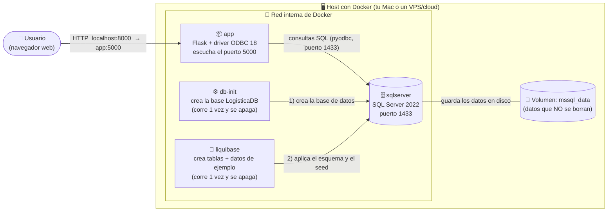
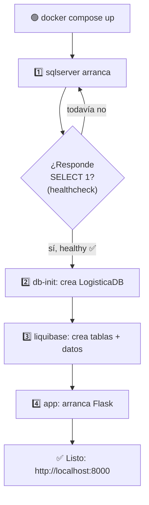
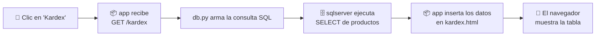

# 🏗️ Arquitectura del Sistema — Peluquería Mary

> Documento para entender **cómo está armado** el sistema, pieza por pieza.
> Pensado para que alguien que recién empieza (junior) lo entienda sin contexto previo.

📂 Diagrama editable en draw.io: [diagramas/arquitectura.drawio](diagramas/arquitectura.drawio)

---

## 1. Idea en una frase

El sistema es una **aplicación web** (hecha en Python con Flask) que guarda su
información en una **base de datos SQL Server**. Todo corre dentro de **Docker**,
que es como tener varias "computadoras pequeñas" (contenedores) aisladas y
conectadas entre sí, levantadas con un solo comando.

---

## 2. ¿Qué es un contenedor? (rápido, para junior)

Un **contenedor** es un paquete que trae *adentro* todo lo que un programa
necesita para funcionar (el programa + sus librerías + su sistema operativo
mínimo). Ventaja: corre **igual** en tu Mac, en Windows o en un servidor cloud,
sin el clásico "en mi máquina sí funcionaba".

Aquí usamos **4 contenedores**, cada uno con una sola responsabilidad.

---

## 3. Vista general (diagrama)



---

## 4. Las piezas, una por una

### 4.1. 👤 El usuario (navegador)
No es parte de Docker. Es simplemente **tu Chrome/Edge/Firefox** entrando a
`http://localhost:8000`. Todo lo que ve (login, dashboard, tablas) son páginas
HTML que le envía el contenedor `app`.

### 4.2. 📦 Contenedor `app` — la aplicación web
- **Qué es:** el programa en **Python/Flask** ([app.py](../app.py)).
- **Qué hace:** recibe lo que pide el navegador (ej. "muéstrame el kardex"),
  consulta la base de datos y devuelve la página HTML ya armada.
- **Cómo habla con la base:** usa la librería `pyodbc` + el **driver ODBC 18**
  (instalado dentro del contenedor por el [Dockerfile](../Dockerfile)).
- **Puerto:** adentro escucha en el `5000`; hacia afuera lo publicamos en el
  `8000` (porque en Mac el `5000` lo ocupa AirPlay).

### 4.3. 🗄️ Contenedor `sqlserver` — la base de datos
- **Qué es:** un **SQL Server 2022** oficial de Microsoft.
- **Qué hace:** guarda todas las tablas (usuarios, productos, movimientos…).
- **Puerto:** `1433` (el estándar de SQL Server).
- **Salud (healthcheck):** Docker le pregunta cada pocos segundos
  `SELECT 1`; hasta que no responde "estoy listo", los demás contenedores
  esperan.

### 4.4. ⚙️ Contenedor `db-init` — crea la base
- **Qué es:** un contenedor de **un solo uso**.
- **Qué hace:** ejecuta un comando que crea la base `LogisticaDB` *si no existe*,
  y luego se apaga. Liquibase necesita que la base ya exista para trabajar.

### 4.5. 🔧 Contenedor `liquibase` — crea las tablas y los datos
- **Qué es:** otro contenedor de **un solo uso**.
- **Qué hace:** lee el archivo de cambios
  [db.changelog-master.sql](../liquibase/changelog/db.changelog-master.sql) y crea
  las tablas, vistas y los datos de ejemplo (usuarios, productos…). Lleva un
  registro de lo que ya aplicó, así que si lo corres otra vez **no duplica nada**
  (es *idempotente*).

### 4.6. 💾 Volumen `mssql_data` — la memoria a largo plazo
- **Qué es:** un espacio de disco que Docker administra **por fuera** del
  contenedor de base de datos.
- **Por qué importa:** si borras y recreas el contenedor `sqlserver`, los datos
  **siguen ahí** gracias al volumen. Sin volumen, perderías todo al apagar.

### 4.7. 🔌 La red interna de Docker
Docker crea una red privada donde los contenedores se ven por **nombre**.
Por eso la app se conecta a `sqlserver,1433` (no a una IP). Es como un
"DNS interno" del stack.

---

## 5. ¿Cómo se mapea esto a los archivos del repo?

| Pieza | Archivo(s) |
|---|---|
| Orquestación (qué contenedores y cómo) | [docker-compose.yml](../docker-compose.yml) |
| Cómo se construye la imagen de la app | [Dockerfile](../Dockerfile) |
| Código de la app web | [app.py](../app.py) |
| Acceso a la base de datos (conexión + consultas) | [db.py](../db.py) |
| Configuración (conexión por variables de entorno) | [config.py](../config.py) |
| Páginas HTML | [templates/](../templates/) |
| Estilos y efectos | [static/src/styles.css](../static/src/styles.css) |
| Esquema + datos de ejemplo de la base | [liquibase/changelog/db.changelog-master.sql](../liquibase/changelog/db.changelog-master.sql) |

---

## 6. El arranque ocurre en ORDEN (esto es clave)

Los contenedores **no** arrancan todos a la vez: hay dependencias. Docker espera
con *healthchecks* a que cada paso esté listo antes del siguiente.



**En palabras:**
1. Levanta SQL Server y **espera** a que esté sano.
2. `db-init` crea la base `LogisticaDB`.
3. `liquibase` crea las tablas y mete los datos de ejemplo.
4. `app` arranca y queda escuchando en el puerto 8000.

---

## 7. ¿Cómo viaja una petición? (ejemplo concreto)

Imagina que el usuario hace clic en **"Kardex"**:



1. El navegador pide `GET /kardex`.
2. La app (Flask) recibe la petición en la ruta `/kardex`.
3. `db.py` hace la consulta a SQL Server por la red interna.
4. SQL Server devuelve las filas de productos.
5. Flask "rellena" la plantilla `kardex.html` con esos datos.
6. El navegador recibe el HTML final y lo muestra.

---

## 8. Tecnologías usadas (resumen)

| Capa | Tecnología |
|---|---|
| Frontend (lo que se ve) | HTML + Bootstrap 5 + efectos 3D (Vanta.js, VanillaTilt) |
| Backend (lógica) | Python 3.12 + Flask |
| Acceso a datos | pyodbc + ODBC Driver 18 |
| Base de datos | SQL Server 2022 |
| Versionado de la base | Liquibase |
| Empaquetado/orquestación | Docker + Docker Compose |
| Exportación de reportes | openpyxl (archivos .xlsx) |

---

## 9. Para correrlo

```bash
docker compose up --build
# luego abre: http://localhost:8000
# usuario: admin   contraseña: admin123
```

> 👉 El **flujo de uso** (login, navegación, registrar movimientos, reportes)
> está explicado paso a paso en [FLUJO.md](FLUJO.md).
