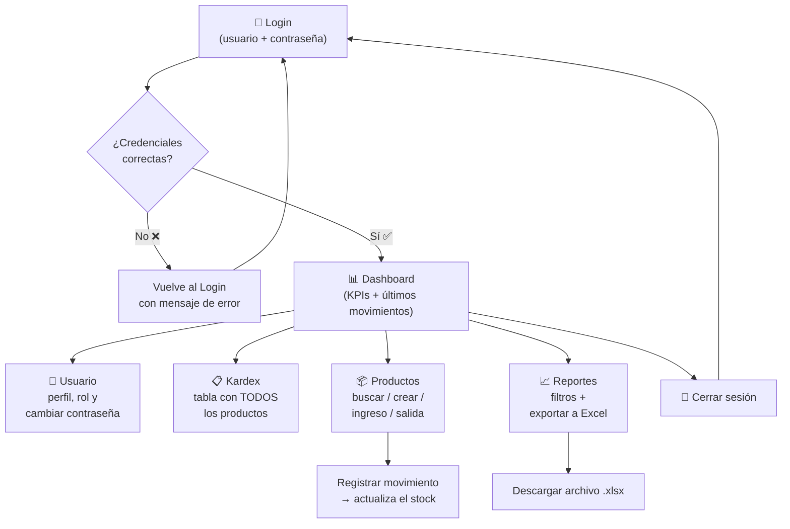
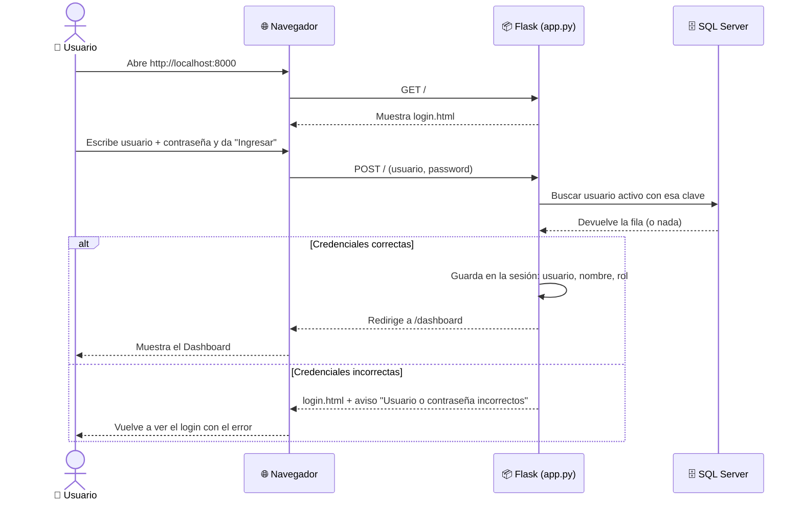
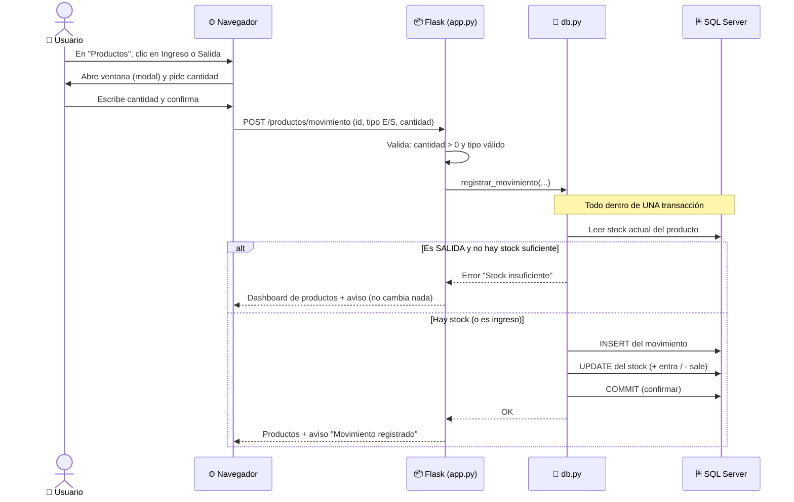
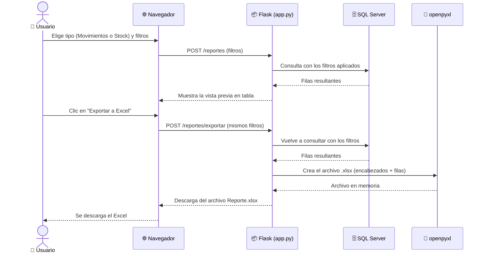
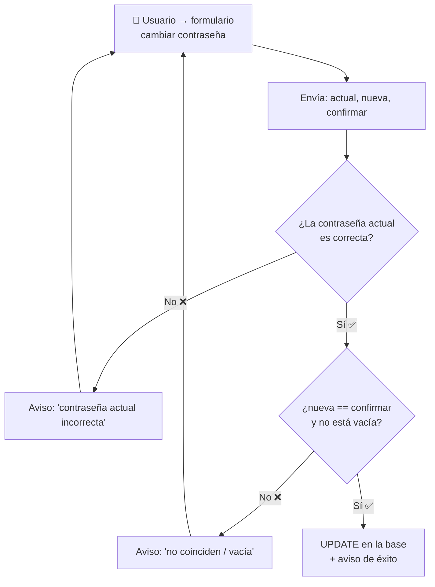
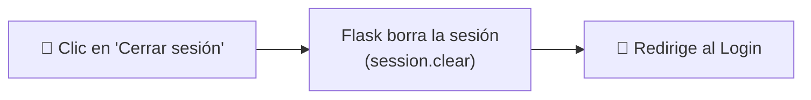

# 🔄 Flujo del Sistema — Peluquería Mary

> Documento para entender **cómo se usa** el sistema y **qué pasa por dentro**
> en cada acción. Paso a paso, pensado para un junior.

📂 Diagrama editable en draw.io: [diagramas/flujo.drawio](diagramas/flujo.drawio)

> Si aún no entiendes *cómo está armado* el sistema (contenedores, base de datos),
> lee primero [ARQUITECTURA.md](ARQUITECTURA.md).

---

## 1. Mapa general del recorrido del usuario

Este es el "viaje" completo: desde que entras hasta que sales.

**Las 5 opciones del menú lateral** (lo que pediste):

| Botón | Qué hace |
|---|---|
| **Usuario** | Muestra tus datos, tu **rol**, y permite **cambiar la contraseña**. |
| **Kardex** | Tabla con el **detalle total** de productos (stock, precios, estado). |
| **Productos** | **Buscar**, **crear** productos y registrar **ingresos/salidas**. |
| **Reportes** | **Filtrar** y **exportar a Excel** (movimientos o stock). |
| **Cerrar sesión** | Borra la sesión y **regresa al login**. |

---

## 2. Flujo de LOGIN (paso a paso, por dentro)

**En palabras simples:**
1. Entras a la página → Flask te muestra el formulario de login.
2. Envías usuario y contraseña.
3. Flask le pregunta a la base si existe un usuario **activo** con esa clave.
4. Si **sí**: guarda tus datos en la *sesión* (para recordarte) y te lleva al dashboard.
5. Si **no**: te muestra de nuevo el login con un mensaje de error.

> 🔒 **Sesión** = la forma en que el sistema "te recuerda" mientras navegas. Si
> intentas entrar a `/kardex` sin haber iniciado sesión, te devuelve al login
> (esto lo hace el decorador `login_required` en [app.py](../app.py)).

---

## 3. Flujo de PRODUCTOS: registrar un ingreso o salida

Esta es la parte más importante porque **modifica el stock** y debe ser segura.

**Paso a paso, en palabras:**
1. En la página de Productos haces clic en **Ingreso** (E) o **Salida** (S).
2. Se abre una ventanita pidiendo la **cantidad**.
3. Al confirmar, Flask **valida** que la cantidad sea mayor a cero.
4. `db.py` abre una **transacción** (un bloque "todo o nada"):
   - Lee el stock actual.
   - Si es **salida** y pides más de lo que hay → **rechaza** y no toca nada.
   - Si todo bien → inserta el movimiento, ajusta el stock y **confirma** (commit).
5. Vuelves a la lista de productos con un mensaje de éxito o de error.

> 💡 **¿Por qué una transacción?** Para que sea imposible que se registre el
> movimiento pero el stock quede sin actualizar (o viceversa). O pasan **las dos
> cosas**, o **ninguna**.

---

## 4. Flujo de REPORTES: filtrar y exportar a Excel

**Paso a paso:**
1. Eliges el **tipo de reporte**: *Movimientos* (entradas/salidas) o *Stock* (inventario actual).
2. Aplicas filtros (fechas, categoría, producto, tipo…).
3. "Generar vista previa" → ves los resultados en pantalla.
4. "Exportar a Excel" → Flask vuelve a consultar con esos filtros, arma un
   archivo `.xlsx` con **openpyxl** y te lo **descarga**.

---

## 5. Flujo de CAMBIO DE CONTRASEÑA (botón Usuario)

1. Escribes tu contraseña **actual** + la **nueva** (dos veces).
2. El sistema verifica que la actual sea correcta.
3. Verifica que la nueva no esté vacía y que ambas coincidan.
4. Si todo está bien, **actualiza** la contraseña y te avisa.

---

## 6. Flujo de CERRAR SESIÓN

Simple: se borra la sesión (el sistema "te olvida") y vuelves al login. Si
intentas volver atrás a una página interna, te pedirá iniciar sesión otra vez.

---

## 7. Resumen de rutas (para ubicarte en el código)

| Acción del usuario | Ruta (URL) | Método | Dónde está |
|---|---|---|---|
| Ver login / iniciar sesión | `/` | GET / POST | [app.py](../app.py) |
| Dashboard | `/dashboard` | GET | [app.py](../app.py) |
| Usuario (perfil) | `/usuarios` | GET | [app.py](../app.py) |
| Cambiar contraseña | `/usuarios/password` | POST | [app.py](../app.py) |
| Kardex | `/kardex` | GET | [app.py](../app.py) |
| Productos (lista/buscar) | `/productos` | GET | [app.py](../app.py) |
| Crear producto | `/productos/crear` | POST | [app.py](../app.py) |
| Ingreso / Salida | `/productos/movimiento` | POST | [app.py](../app.py) |
| Reportes (vista previa) | `/reportes` | GET / POST | [app.py](../app.py) |
| Exportar Excel | `/reportes/exportar` | POST | [app.py](../app.py) |
| Cerrar sesión | `/logout` | GET | [app.py](../app.py) |
